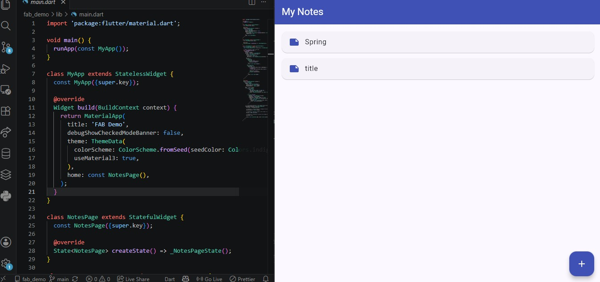

# flutter-fab-demo
FloatingActionButton, also called FAB. It's a circular button that floats over the screen content and represents the main action of a page.
# How to run
git clone https://github.com/Nazira-umucyo/flutter-fab-demo.git

cd flutter-fab-demo

flutter pub get

flutter run

# Three properties used
1. backgroundColor: this controls the color of button, that's why the button is blue.

2. tooltip: this shows a small hint label above the button when you long press it. Helps screen readers describe the button to users.

3. elevation: this controls the shadow beneath the button. 

# screenshoot

# presentation date: 22/06/2026
